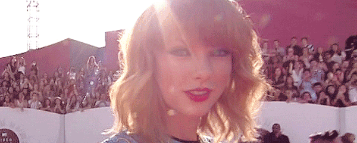

# Redis Subscription Test

Using redis pub-sub, this Go code subscribes to two local Redis channels: `taylor` and `swift`.
It then uses an unbuffered channel in Go to monitor incoming messages.




## Usage

In one terminal, run `go run main.go`. Then, in another, fire up your `redis-cli` and publish some
messages:

```
PUBLISH taylor "has the best fans"
PUBLISH swift "tay tay"
PUBLISH taylor "shakes it off"
```

You should see output in the first terminal

```
Message received on 'taylor': has the best fans
Message received on 'swift': tay tay
Message received on 'taylor': shakes it off
```

## Reconnecting

Per [the Redis PubSub docs](https://godoc.org/github.com/go-redis/redis#PubSub), reconnection should be automatic.
